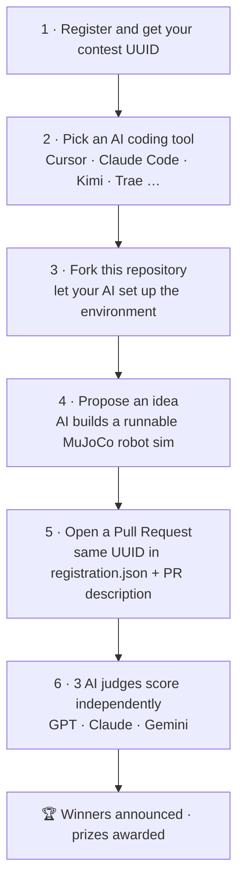

<div align="center">

# 🤖 Robothon 2026

### Faraday Future · MuJoCo Robotics Simulation Hackathon

**English** · [中文](README.zh-CN.md)

Team up with an AI coding agent, build a runnable robot simulation in
[MuJoCo](https://github.com/google-deepmind/mujoco), and submit it as a Pull Request.
Every entry is scored by an AI judge panel.

</div>

---

## 📌 Key Links

| | |
|---|---|
| 📝 Register / get your contest UUID | [robothon.ff.com](https://robothon.ff.com) |
| 📜 Official rules | [robothon.ff.com/official-rules](https://robothon.ff.com/official-rules) |
| 💬 Questions & support | [Discord](https://discord.gg/gSStjCWA) |

---

## 🚀 What is Robothon 2026?

Robothon 2026 is Faraday Future's open robotics-simulation hackathon. You partner
with an AI coding tool to design and build a **runnable MuJoCo robot simulation** —
a task, an interactive system, or a data-collection environment — and submit it as a
**Pull Request** to this repository. Submissions are reviewed and scored entirely by
an AI judge panel against one public rubric.

You don't need to be a robotics expert. Bring an idea; let the AI help you build it.

---

## 🗺️ How to Participate

1. **Register and get your contest UUID.** Sign up on the official Robothon platform and copy the **registration UUID** issued to you.
2. **Pick an AI coding tool** — Cursor, Claude Code, Kimi, Trae, or any agent you like.
3. **Fork this repository** ([`Faraday-Future-AI/Robothon-starter`](https://github.com/Faraday-Future-AI/Robothon-starter/fork)) and let your AI set up the run environment.
4. **Propose an idea**, and have the AI build a runnable robot simulation in MuJoCo.
5. **Open a Pull Request**, putting the **same UUID** in both [`registration.json`](submissions/SUBMISSION_TEMPLATE/registration.json) and the PR description.
6. **Three AI judges (GPT · Claude · Gemini)** score every entry independently; winners are announced and prizes awarded.



> 💡 **Tip:** When you hit an error, paste the message (or a screenshot) back to your AI tool and ask it to fix it — most issues resolve in a round or two.

---

## 🔑 Registration UUID (Required)

You must include the **same UUID** in **both** places:

**1. In your submission folder — `registration.json`:**

```json
{
  "uuid": "00000000-0000-0000-0000-000000000000",
  "participant_name": "Your Name or Team Name",
  "project_name": "Your Project Name"
}
```

**2. In your Pull Request description** (the PR template will prompt you). If the template isn't shown, add this line at the top:

```markdown
Registration UUID: 00000000-0000-0000-0000-000000000000
```

> ⚠️ The UUID in `registration.json` and your PR description **must match exactly.**
> Do not share or reuse another participant's UUID. Submissions without a valid UUID in both places may be rejected.

Use [`submissions/SUBMISSION_TEMPLATE/`](submissions/SUBMISSION_TEMPLATE) as your starting point.

---

## ✅ Eligibility

To enter, participants must meet all of the following requirements:

- Must be **18 or older** (or the age of majority in your country/region, whichever is greater).
- Must not be a resident of Cuba, Iran, North Korea, Syria, or Ukraine.
- Must not be an employee, officer, director, contractor, or agent of Faraday Future and its affiliates, or an immediate family / household member of any such person.

The contest is open to eligible participants worldwide; void where prohibited or restricted by law.

See the **official rules** for the complete and binding terms.

---

## 🏆 Prizes & Judging

- **AI judge panel.** Every submission is scored entirely by an AI panel — **GPT · Claude · Gemini** — with no human scoring, against one public rubric.
- **Winner determination.** The winner is determined purely by the highest rubric score.
- **Prizes.** Prizes will be awarded to the top entries. See the **official rules** for prize details.

**Scoring rubric:**

| Criterion | What we look for |
|---|---|
| Reproducibility | Does the code run cleanly and is it easy to reproduce? |
| MuJoCo depth | Use of MJCF, physics, collisions, joints, sensors, actuators |
| Task design | Clarity, challenge, and real-world relevance |
| Control | Teleoperation, autonomy, policy control, planning, or data collection |
| Dexterity | Multi-finger coordination and fine manipulation (if applicable) |
| Engineering quality | Code structure, docs, configuration, asset management |
| Presentation | Demo-video clarity and persuasiveness |
| Innovation | Novelty in scene, robot, task, or application |

---

## ⚙️ Quick Start

```bash
git clone https://github.com/Faraday-Future-AI/Robothon-starter.git
cd $(basename Faraday-Future-AI/Robothon-starter)
python3 -m pip install -r requirements.txt
```

Run the example demos:

```bash
python examples/run_ff_master_demo.py
python examples/run_aegis_demo.py
python examples/run_futurist_demo.py --check-assets
```

`run_futurist_demo.py` generates a MuJoCo showcase video when the Futurist mesh files
are present. Use `--check-assets` first to verify that every mesh referenced by
`assets/Futurist/futurist.urdf` is included.

Open the MuJoCo viewer:

```bash
python -m mujoco.viewer
```

---

## 📦 What's in This Repo

| Path | Description |
|------|-------------|
| `assets/Master/` | FF Master humanoid MuJoCo assets (ultra / hand / fist variants) |
| `assets/Aegis/` | Aegis quadruped URDF / MuJoCo model |
| `assets/Futurist/` | FF Futurist humanoid URDF asset package |
| `examples/` | Example run scripts |
| `model_catalog.json` | Reference list of recommended open-source robot models |
| `submissions/SUBMISSION_TEMPLATE/` | Submission folder template with UUID placeholder |

**Example scripts**

| Script | Asset | Output |
|--------|-------|--------|
| `examples/run_ff_master_demo.py` | `assets/Master/scene.xml` | FF Master showcase video + trajectory JSON |
| `examples/run_aegis_demo.py` | `assets/Aegis/urdf/Aegis_mujoco.urdf` | Aegis patrol video + trajectory JSON |
| `examples/run_futurist_demo.py` | `assets/Futurist/futurist.urdf` | Futurist showcase video + trajectory JSON |

---

## 📝 Submission Checklist

Each Pull Request should include:

- [ ] Your project under `submissions/<your-project-name>/`
- [ ] Project source code
- [ ] MuJoCo scene files / robot models / related assets
- [ ] Run instructions: dependencies, install steps, launch commands, controls
- [ ] A demo video (or video link)
- [ ] `registration.json` with your platform-issued UUID
- [ ] The same UUID in your PR description
- [ ] A short project summary: name, robot platform, task goal, technical approach, core features, highlights, current limitations, future improvements

---

## 🎥 Demo Video Requirements

The video must be produced by running your submitted code, and should show:

- Simulation startup
- Robot platform and task scene
- Task execution
- Teleoperation, autonomous control, or data-collection logic
- Final result or task state

Recommended length: **1–3 minutes.**

---

## 💡 Recommended Directions

- **Advanced teleoperation** — keyboard, gamepad, VR, Web UI, motion capture
- **Long-horizon tasks** — navigation, grasping, carrying, assembly, door opening, tidying, cleaning
- **Data collection** — auto-generated trajectories, states, actions, images, depth, sensor streams, labels
- **Dexterous manipulation** — multi-finger grasping, in-hand rotation, tool use, button presses, bottle opening
- **Real-world scenarios** — K12 education, campus security, home service, warehouse logistics, industrial inspection
- **Open exploration** — any creative MuJoCo robotics simulation project

**Encouraged robot platforms** (open-source models welcome): Unitree Go1 / Go2 / G1, Boston Dynamics Spot, Franka Emika Panda, Shadow Hand, LEAP Hand, Robotiq Gripper, or any MuJoCo / MJCF open model. See [`model_catalog.json`](model_catalog.json), the [MuJoCo Menagerie](https://github.com/google-deepmind/mujoco_menagerie), and the [MuJoCo Model Gallery](https://mujoco.readthedocs.io/en/latest/models.html).

---

## 📜 Official Rules & Legal

This page is a friendly summary. The **official rules** are the complete and binding
terms — please read them before entering.

- **Intellectual property.** You keep ownership of your submission. By entering, you grant Faraday Future a non-exclusive, royalty-free, worldwide license to use, reproduce, display, and distribute your entry for promotional and business purposes.
- **Eligibility & taxes.** See the official rules for full eligibility, prize, and tax terms.
- **Sponsor.** Faraday Future Intelligent Electric, Inc. (d/b/a Faraday Future), 1990 E. Grand Ave., El Segundo, CA 90245.

> _Nothing in this repository constitutes investment advice or a recommendation regarding any security._

---

<div align="center">

**Ready?** Register, fork, build, and open your Pull Request. Good luck! 🚀

</div>
