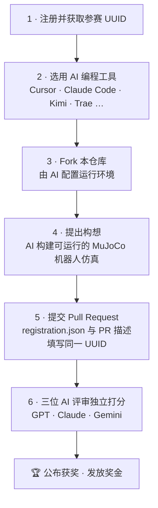

<div align="center">

# 🤖 Robothon 2026

### Faraday Future · MuJoCo 机器人仿真黑客松

[English](README.md) · **中文**

与 AI 编程助手组队，用 [MuJoCo](https://github.com/google-deepmind/mujoco)
搭建一个可运行的机器人仿真，并以 Pull Request 的形式提交。
每一份参赛作品都由 AI 评审团打分。

</div>

---

## 📌 重要链接

| | |
|---|---|
| 📝 报名 / 获取参赛 UUID | [robothon.ff.com](https://robothon.ff.com) |
| 📜 官方规则 | [robothon.ff.com/official-rules](https://robothon.ff.com/official-rules) |
| 💬 提问与支持 | [Discord](https://discord.gg/gSStjCWA) |

---

## 🚀 什么是 Robothon 2026？

Robothon 2026 是 Faraday Future 面向所有人的机器人仿真黑客松。你将与一款 AI 编程工具组队，
设计并搭建一个**可运行的 MuJoCo 机器人仿真**——可以是一个任务、一个交互系统，或一个数据采集环境——
并以 **Pull Request** 的形式提交到本仓库。所有作品完全由 AI 评审团依据同一套公开评分标准打分。

你不需要是机器人专家。带上一个想法，让 AI 帮你把它实现出来。

---

## 🗺️ 如何参与

1. **注册并获取你的参赛 UUID。** 在官方 Robothon 平台报名，复制系统发给你的**参赛 UUID**。
2. **选用一款 AI 编程工具** —— Cursor、Claude Code、Kimi、Trae，或任何你习惯的 Agent。
3. **Fork 本仓库**（[`Faraday-Future-AI/Robothon-starter`](https://github.com/Faraday-Future-AI/Robothon-starter/fork)），由 AI 配置运行环境。
4. **提出构想**，让 AI 在 MuJoCo 中构建一个可运行的机器人仿真。
5. **提交 Pull Request**，并在 [`registration.json`](submissions/SUBMISSION_TEMPLATE/registration.json) 与 PR 描述中填写**同一个 UUID**。
6. **三位 AI 评审（GPT · Claude · Gemini）** 独立打分；公布获奖名单并发放奖金。



> 💡 **小贴士：** 遇到报错时，把报错信息（或截图）发回给你的 AI 工具让它修复——大多数问题一两轮就能解决。

---

## 🔑 参赛 UUID（必填）

你必须在**两个**地方填写**同一个 UUID**：

**1. 提交文件夹中的 `registration.json`：**

```json
{
  "uuid": "00000000-0000-0000-0000-000000000000",
  "participant_name": "你的姓名或团队名",
  "project_name": "你的项目名称"
}
```

**2. Pull Request 描述中**（PR 模板会提示你）。如果模板没有自动出现，请在描述顶部加上这一行：

```markdown
Registration UUID: 00000000-0000-0000-0000-000000000000
```

> ⚠️ `registration.json` 与 PR 描述中的 UUID **必须完全一致。**
> 请勿分享或盗用他人的 UUID。两处缺少有效 UUID 的提交可能会被拒绝。

请以 [`submissions/SUBMISSION_TEMPLATE/`](submissions/SUBMISSION_TEMPLATE) 作为起始模板。

---

## ✅ 参赛资格

报名时，参赛者须满足以下全部条件：

- 须年满 **18 周岁**（或所在国家 / 地区的法定成年年龄，以较高者为准）。
- 不得为古巴、伊朗、朝鲜、叙利亚或乌克兰的居民。
- 不得为 Faraday Future 及其关联公司的员工、高管、董事、承包商、代理人，及其直系亲属 / 同住家庭成员。

本比赛面向全球符合资格的参赛者开放；法律禁止或限制之地无效。

完整且具约束力的条款请以**官方规则**为准。

---

## 🏆 奖项与评审

- **AI 评审团。** 每份作品完全由 AI 评审团打分——**GPT · Claude · Gemini**——全程无人工打分，依据同一套公开评分标准。
- **获奖判定。** 获奖完全由评分标准的最高分决定。
- **奖项。** 奖金将颁发给优胜作品。奖项细则请见**官方规则**。

**评分标准：**

| 维度 | 我们关注什么 |
|---|---|
| 可复现性 | 代码能否顺利运行、是否易于复现 |
| MuJoCo 深度 | 对 MJCF、物理、碰撞、关节、传感器、执行器的运用 |
| 任务设计 | 清晰度、挑战性与现实意义 |
| 控制能力 | 遥操作、自主控制、策略控制、任务规划或数据采集 |
| 灵巧操作 | 多指协调与精细操作（如适用） |
| 工程质量 | 代码结构、文档、配置、资产管理 |
| 演示呈现 | 演示视频的清晰度与说服力 |
| 创新性 | 场景、机器人、任务或应用方向上的新意 |

---

## ⚙️ 快速开始

```bash
git clone https://github.com/Faraday-Future-AI/Robothon-starter.git
cd $(basename Faraday-Future-AI/Robothon-starter)
python3 -m pip install -r requirements.txt
```

运行示例 Demo：

```bash
python examples/run_ff_master_demo.py
python examples/run_aegis_demo.py
python examples/run_futurist_demo.py --check-assets
```

当 Futurist 网格文件齐全时，`run_futurist_demo.py` 会生成一段 MuJoCo 展示视频。
建议先用 `--check-assets` 确认 `assets/Futurist/futurist.urdf` 引用的每个网格文件都存在。

打开 MuJoCo 查看器：

```bash
python -m mujoco.viewer
```

---

## 📦 仓库内容

| 路径 | 说明 |
|------|-------------|
| `assets/Master/` | FF Master 人形机器人 MuJoCo 资产（ultra / hand / fist 变体） |
| `assets/Aegis/` | Aegis 四足机器人 URDF / MuJoCo 模型 |
| `assets/Futurist/` | FF Futurist 人形机器人 URDF 资产包 |
| `examples/` | 示例运行脚本 |
| `model_catalog.json` | 推荐开源机器人模型清单 |
| `submissions/SUBMISSION_TEMPLATE/` | 提交文件夹模板（含 UUID 占位符） |

**示例脚本**

| 脚本 | 资产 | 输出 |
|--------|-------|--------|
| `examples/run_ff_master_demo.py` | `assets/Master/scene.xml` | FF Master 展示视频 + 轨迹 JSON |
| `examples/run_aegis_demo.py` | `assets/Aegis/urdf/Aegis_mujoco.urdf` | Aegis 巡逻视频 + 轨迹 JSON |
| `examples/run_futurist_demo.py` | `assets/Futurist/futurist.urdf` | Futurist 展示视频 + 轨迹 JSON |

---

## 📝 提交清单

每个 Pull Request 应包含：

- [ ] 你的项目，放在 `submissions/<你的项目名>/` 下
- [ ] 项目源代码
- [ ] MuJoCo 场景文件 / 机器人模型 / 相关资产
- [ ] 运行说明：依赖、安装步骤、启动命令、操作方式
- [ ] 一段演示视频（或视频链接）
- [ ] 含平台发放 UUID 的 `registration.json`
- [ ] PR 描述中填写同一个 UUID
- [ ] 简短的项目说明：名称、机器人平台、任务目标、技术方案、核心功能、亮点、当前局限、未来改进

---

## 🎥 演示视频要求

视频必须由你提交的代码实际运行产生，并应展示：

- 仿真启动
- 机器人平台与任务场景
- 任务执行过程
- 遥操作、自主控制或数据采集逻辑
- 最终结果或任务状态

建议时长：**1–3 分钟。**

---

## 💡 推荐方向

- **进阶遥操作** —— 键盘、手柄、VR、Web UI、动作捕捉
- **长程任务** —— 导航、抓取、搬运、装配、开门、整理、清洁
- **数据采集** —— 自动生成轨迹、状态、动作、图像、深度、传感器流、标签
- **灵巧操作** —— 多指抓取、手内旋转、工具使用、按按钮、开瓶盖
- **真实场景** —— K12 教育、园区安防、家庭服务、仓储物流、工业巡检
- **自由探索** —— 任何有创意的 MuJoCo 机器人仿真项目

**推荐机器人平台**（欢迎使用开源模型）：Unitree Go1 / Go2 / G1、Boston Dynamics Spot、Franka Emika Panda、Shadow Hand、LEAP Hand、Robotiq Gripper，或任意 MuJoCo / MJCF 开源模型。可参考 [`model_catalog.json`](model_catalog.json)、[MuJoCo Menagerie](https://github.com/google-deepmind/mujoco_menagerie) 与 [MuJoCo 模型库](https://mujoco.readthedocs.io/en/latest/models.html)。

---

## 📜 官方规则与法务

本页面仅为便于阅读的摘要。**官方规则**才是完整且具约束力的条款——参赛前请务必阅读。

- **知识产权。** 你保留对作品的所有权。参赛即表示你授予 Faraday Future 一项非独占、免版税、全球范围的许可，用于在推广及业务场景中使用、复制、展示和分发你的作品。
- **资格与税务。** 完整的资格、奖项与税务条款请见官方规则。
- **主办方。** Faraday Future Intelligent Electric, Inc.（d/b/a Faraday Future），地址：1990 E. Grand Ave., El Segundo, CA 90245。

> _本仓库中的任何内容均不构成投资建议，亦不构成对任何证券的推荐。_

---

<div align="center">

**准备好了吗？** 报名、Fork、构建，然后提交你的 Pull Request。祝你好运！🚀

</div>
